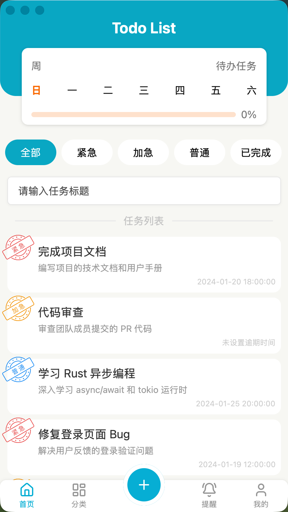
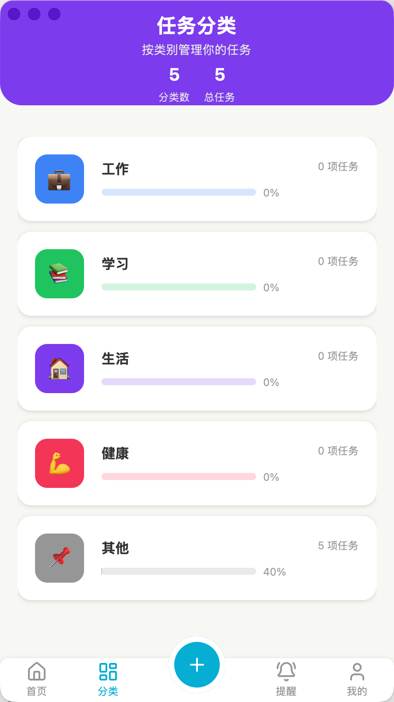
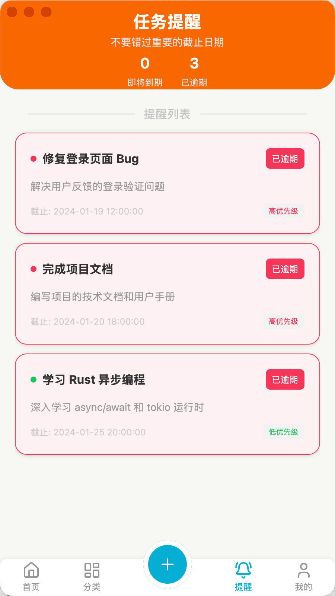
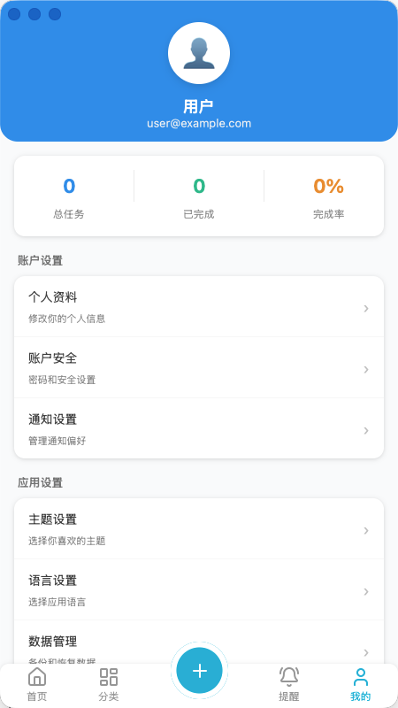

# Todo List

一个基于 Rust 和 GPUI 框架开发的现代化待办事项桌面应用。

## 效果预览

<table>
<tr>
<td width="50%">

### 首页



</td>
<td width="50%">

### 分类页



</td>
</tr>
<tr>
<td width="50%">

### 提醒页



</td>
<td width="50%">

### 我的页



</td>
</tr>
</table>

## 功能特性

- ✅ **任务管理** - 创建、查看和管理待办任务
- 🎯 **优先级分类** - 支持高、中、低三种优先级，不同优先级显示不同图标
- 🔍 **任务搜索** - 支持按任务名称和描述搜索
- 🏷️ **分类筛选** - 按优先级筛选任务列表
- 📂 **分类管理** - 按工作、学习、生活等类别管理任务
- ⏰ **任务提醒** - 查看任务到期时间和逾期提醒
- 👤 **个人中心** - 查看任务统计和个人设置
- 🎨 **现代化 UI** - 基于 GPUI Component 的美观界面
- 📱 **底部导航** - 首页、分类、提醒、我的四个功能模块
- ➕ **快速添加** - 底部中央醒目的添加按钮，支持添加新任务
- 💾 **本地存储** - 使用 JSON 文件存储任务数据
- 🗂️ **资源嵌入** - 使用 rust-embed 嵌入资源，无需外部依赖文件
- 🚀 **跨平台** - 支持 macOS、Windows、Linux

## 技术栈

- **Rust 2024 Edition** - 最新版 Rust，提供高性能和内存安全
- **GPUI 0.2** - 现代化的跨平台 UI 框架
- **GPUI Component 0.5** - 丰富的 UI 组件库
- **Chrono** - 日期时间处理
- **Serde** - 序列化/反序列化
- **Rust-Embed** - 资源文件嵌入
- **Lazy Static** - 全局静态变量

## 安装

### 前置要求

- Rust 1.90 或更高版本
- Cargo（随 Rust 一起安装）

### 构建步骤

```bash
# 克隆仓库
git clone https://github.com/your-username/todo_list.git
cd todo_list

# 构建项目
cargo build

# 运行应用
cargo run
```

## 使用方法

### 启动应用

```bash
cargo run
```

### 主要功能

1. **首页** - 查看所有任务列表，支持搜索和按优先级筛选
2. **分类** - 按工作、学习、生活等类别查看和管理任务
3. **提醒** - 查看任务到期时间，逾期任务会有醒目提示
4. **我的** - 查看任务统计、完成率和个人设置

### 添加任务

点击底部中央的蓝色加号按钮，在弹出的模态框中填写：
- 任务名称（必填）
- 任务优先级（高/中/低）
- 预计完成时间（可选）
- 任务描述（可选）

### 任务数据

任务数据存储在 `data/task_list.json` 文件中，格式如下：

```json
[
  {
    "id": 1,
    "task_name": "示例任务",
    "priority": "high",
    "create_time": "2024-01-01 10:00:00",
    "overdue_time": "2024-01-15 18:00:00",
    "description": "这是一个示例任务"
  }
]
```

## 项目结构

```
todo_list/
├── src/
│   ├── components/           # 组件模块
│   │   ├── home/             # 首页组件
│   │   │   ├── header.rs     # 页面头部
│   │   │   ├── home_page.rs  # 首页主页面
│   │   │   └── menu.rs       # 分类菜单
│   │   ├── category/         # 分类组件
│   │   │   └── category_page.rs
│   │   ├── reminder/         # 提醒组件
│   │   │   └── reminder_page.rs
│   │   ├── profile/          # 我的组件
│   │   │   └── profile_page.rs
│   │   ├── modal/            # 模态框组件
│   │   │   └── add_task_modal.rs
│   │   ├── interface.rs      # 页面布局 trait
│   │   └── layout.rs         # 主布局组件
│   ├── assets/               # 资源文件
│   │   ├── icon/
│   │   │   ├── home/         # 任务优先级图标
│   │   │   └── tabber/       # 底部导航图标
│   │   └── images/           # 图片资源
│   ├── main.rs               # 应用入口
│   └── todo_icon_assets.rs   # 资源加载
├── config/                   # 配置文件
│   └── home_menu.json        # 首页菜单配置
├── data/                     # 数据文件
│   └── task_list.json        # 任务列表数据
├── docs/                     # 文档和效果图
├── Cargo.toml                # 项目配置
└── README.md                 # 项目说明
```

## 开发

### 窗口配置

应用窗口默认配置：
- 尺寸：450 x 800 像素
- 居中显示
- 透明标题栏

### 添加新功能

1. 在 `src/components/` 下创建新的组件模块
2. 实现 `PageLayout` trait
3. 在 `layout.rs` 中注册新的标签页

## 功能亮点

### 任务优先级可视化
- 高优先级：红色图标
- 中优先级：橙色图标
- 低优先级：绿色图标

### 智能提醒
- 逾期任务：红色背景高亮显示
- 即将到期：黄色背景提示
- 正常任务：白色背景

### 分类统计
- 显示每个分类的任务数量
- 实时计算完成进度
- 进度条可视化展示

## 待开发功能

- [ ] 任务编辑功能
- [ ] 任务删除功能
- [ ] 任务完成标记
- [ ] 任务分类设置
- [ ] 深色模式
- [ ] 数据导出
- [ ] 任务标签系统
- [ ] 子任务支持

## 许可证

MIT License
